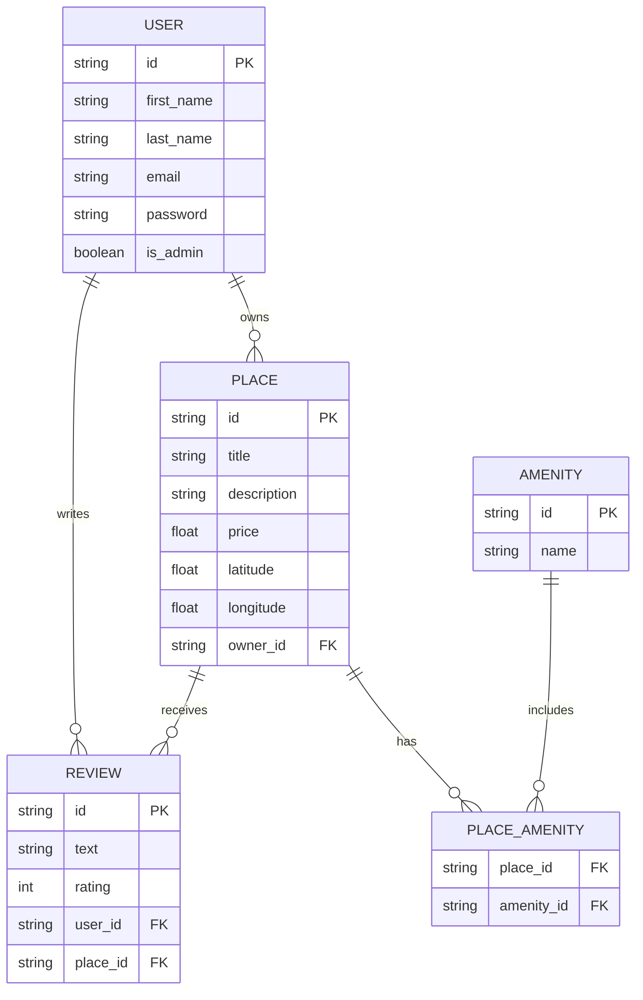

# HBnB - Full Stack Web Application

## 📌 Overview

HBnB is a full-stack web application for discovering and reviewing unique places to stay. It combines a **Flask REST API** backend — backed by a relational database, JWT authentication, and role-based access control — with a **multi-page frontend** (HTML, CSS, Vanilla JavaScript) that covers the complete user journey: browsing places, viewing details, submitting reviews, and managing listings.

---

## Preview

> A glimpse of the HBnB web experience — browse curated stays, discover featured properties, and explore the full catalogue.

### Landing Page


*The entry point of the application: a full-width hero carousel, top navigation with login access, and quick-access buttons to jump to recommended or all available places.*

---

### Featured Places


*A curated selection of standout properties highlighted for the user, presented in an elegant card layout with key details at a glance.*

---

### All Places


*The complete catalogue — every listed property rendered in a responsive grid, ready to browse, filter, and explore.*

---

### Core Features:
- **Place Browsing**: Landing page with hero carousel, featured section, and full catalogue
- **Place Detail**: Dedicated page per listing with amenities, reviews, and imagery
- **Authentication Flow**: Login page with JWT cookie storage; session-aware navigation
- **Review Submission**: Authenticated users can submit star-rated reviews
- **Place Creation**: Authenticated users can list a new property
- **Admin Panel**: Admin management interface for privileged operations
- **Database Integration**: SQL-based persistence with SQLAlchemy ORM
- **JWT Authentication**: Secure login with token-based access
- **Role-Based Access**: Admin checks for protected operations
- **Place & Review Deletion**: DELETE endpoints with owner/admin authorization

## ✅ Objectives

- **Build a Dynamic Frontend:**
  Create a multi-page application that consumes the REST API, handles JWT sessions via cookies, and provides a polished user experience for browsing, reviewing, and managing places.

- **Integrate a Relational Database:**
  Persist all entities in a SQL database using the repository pattern with SQLAlchemy ORM relationships.

- **Implement JWT Authentication:**
  Issue JWT tokens on login, validate credentials with password hashing, and include admin claims in tokens.

- **Add Authorization & Role Management:**
  Protect sensitive endpoints with admin-only access checks and owner verification.

- **Enhance Business Logic Layer:**
  Build core models with database relationships, maintain the **Facade pattern**, and implement proper validation and error handling.

## 🧾 Learning Objectives

- Frontend-Backend Integration via REST API
- DOM Manipulation and Dynamic Rendering with Vanilla JavaScript
- Session Management with JWT Cookies
- Relational Database Design and Integration
- JWT Authentication and Authorization
- Role-Based Access Control (RBAC)
- SQLAlchemy ORM and Relationships
- Repository Pattern for Data Persistence
- API Security Best Practices
- Password Hashing and Credential Validation
- Modular Architecture with Database Layer

## 📁 Project Structure

```
holbertonschool-hbnb/part4/
├── front_end/                          # Static frontend (served separately)
│   ├── index.html                      # Landing page: hero, featured, all places
│   ├── login.html                      # Login form
│   ├── place.html                      # Place detail with amenities & reviews
│   ├── create_place.html               # Create a new listing (auth required)
│   ├── add_review.html                 # Submit a review (auth required)
│   ├── admin.html                      # Admin management panel
│   ├── scripts.js                      # All frontend JS (API calls, rendering)
│   └── styles.css                      # Application stylesheet
└── hbnb/                               # Flask backend
    ├── app/
    │   ├── __init__.py                 # App factory: Flask, SQLAlchemy, JWT, CORS
    │   ├── api/
    │   │   └── v1/
    │   │       ├── users.py            # User endpoints
    │   │       ├── places.py           # Place endpoints
    │   │       ├── reviews.py          # Review endpoints
    │   │       ├── amenities.py        # Amenity endpoints
    │   │       ├── auth.py             # JWT login endpoint
    │   │       └── protected.py        # Admin-only protected endpoint
    │   ├── models/
    │   │   ├── base_model.py           # Abstract base with validation helpers
    │   │   ├── user.py                 # User: password hashing, is_admin
    │   │   ├── place.py                # Place: relationships, to_dict()
    │   │   ├── review.py               # Review: rating, text, FK refs
    │   │   └── amenity.py              # Amenity: name
    │   ├── services/
    │   │   ├── facade.py               # HBnBFacade: central business logic hub
    │   │   └── repositories/           # Specialized repositories
    │   │       ├── user_repository.py
    │   │       ├── place_repository.py
    │   │       ├── review_repository.py
    │   │       └── amenity_repository.py
    │   └── persistence/
    │       └── repository.py           # Abstract + SQLAlchemyRepository base
    ├── instance/
    │   ├── drop_and_create_tables.sql  # Database schema
    │   └── insert_data.sql             # Sample seed data
    ├── run.py                          # Entry point
    ├── config.py                       # DevelopmentConfig (SQLite)
    ├── seed_data.py                    # Populate DB with sample places & users
    ├── migrate_to_english.py           # One-time script: translate FR→EN place data
    └── requirements.txt
```

### Key Files

| File                                       | Role                                                                           |
| ------------------------------------------ | ------------------------------------------------------------------------------ |
| `part4/front_end/scripts.js`               | All frontend logic: fetch calls, rendering, JWT cookie handling                |
| `part4/front_end/index.html`               | Landing page with hero carousel, featured places, and full catalogue           |
| `part4/hbnb/app/api/v1/auth.py`            | JWT login endpoint — issues tokens on valid credentials                        |
| `part4/hbnb/app/api/v1/protected.py`       | Admin-only endpoint example                                                    |
| `part4/hbnb/app/services/facade.py`        | HBnBFacade: single entry point for all business logic                          |
| `part4/hbnb/app/services/repositories/`   | Specialized repositories for each entity                                       |
| `part4/hbnb/app/models/user.py`            | User model with `hash_password()`, `verify_password()`, and `is_admin` flag    |
| `part4/hbnb/app/persistence/repository.py` | Generic `SQLAlchemyRepository` base class                                      |
| `part4/hbnb/instance/drop_and_create_tables.sql` | Database schema with foreign key relationships                           |
| `part4/hbnb/config.py`                     | App configuration (SQLite URI, secret keys)                                    |
| `part4/hbnb/seed_data.py`                  | Populates the database with sample users, places, amenities, and reviews       |

## ⚒️ Architecture

The application follows a **4-layer architecture**:

| Layer              | Description                                                              | Location                                   |
| ------------------ | ------------------------------------------------------------------------ | ------------------------------------------ |
| **Frontend**       | Static HTML/CSS/JS — consumes the API via `fetch`                        | `part4/front_end/`                         |
| **Presentation**   | Flask-RESTX API endpoints (CRUD + Auth)                                  | `part4/hbnb/app/api/v1/`                   |
| **Business Logic** | Models (`User`, `Place`, `Review`, `Amenity`) + Facade pattern           | `part4/hbnb/app/models/` + `app/services/` |
| **Persistence**    | SQL-based repositories with SQLAlchemy ORM                               | `part4/hbnb/app/services/repositories/`    |
| **Database**       | Relational database (SQLite) with foreign key relationships               | `part4/hbnb/instance/`                     |

### Facade Pattern & Repositories

All API endpoints communicate exclusively through a single `HBnBFacade` instance, which delegates to specialized repositories:

```
API → HBnBFacade → Repositories → Database
```

Each repository handles:
- ✅ Entity-specific queries
- ✅ Relationship management (through ORM)
- ✅ Validation and constraints
- ✅ CRUD operations with persistence

## 📥 Installation & Setup

### Prerequisites

- Python 3.8+
- pip
- Virtual environment tool (optional but recommended)

### Steps

1. Clone the repository:

```bash
git clone https://github.com/<your-username>/holbertonschool-hbnb.git
cd holbertonschool-hbnb/part4/hbnb
```

2. Create a virtual environment (recommended):

```bash
python3 -m venv venv
source venv/bin/activate
```

3. Install dependencies:

```bash
pip install -r requirements.txt
```

4. (Optional) Seed the database with sample data:

```bash
python seed_data.py
```

## 🔎 Usage

The application has two processes that must run simultaneously — the backend API and a static file server for the frontend.

### 1. Start the backend

```bash
cd holbertonschool-hbnb/part4/hbnb
python run.py
```

The API will be available at `http://127.0.0.1:5000`.  
Swagger documentation: `http://127.0.0.1:5000/api/v1/`

### 2. Serve the frontend

Open a second terminal:

```bash
cd holbertonschool-hbnb/part4/front_end
python3 -m http.server 8080
```

Then open `http://localhost:8080/index.html` in your browser.

## 🔐 Authentication & Authorization

### JWT Login

HBnB uses JWT-based authentication for secure API access.

| Method | Endpoint             | Description                    | Status Codes |
| ------ | -------------------- | ------------------------------ | ------------ |
| POST   | `/api/v1/auth/login` | Authenticate and get JWT token | 201, 401     |

**Login with Credentials**

```bash
curl -X POST http://127.0.0.1:5000/api/v1/auth/login \
  -H "Content-Type: application/json" \
  -d '{
    "email": "john.doe@example.com",
    "password": "your_password"
  }'
```

Response (201):

```json
{
  "access_token": "eyJ0eXAiOiJKV1QiLCJhbGciOiJIUzI1NiJ9..."
}
```

### Using JWT Tokens in Protected Endpoints

Include the token in the `Authorization` header for protected operations:

```bash
curl -X DELETE http://127.0.0.1:5000/api/v1/places/<place_id> \
  -H "Authorization: Bearer <access_token>"
```

### Admin Access

Certain endpoints (like creating users, managing amenities, and deleting places) require the `is_admin` claim in the JWT token. Only users with `is_admin=true` can access these operations.

---

## 🔁 API Endpoints & cURL Examples

> 💡 All endpoints are prefixed with `/api/v1/`
>
> ⚠️ Some endpoints require JWT authentication (marked with 🔒)

### Users

| Method | Endpoint                  | Description                       | Status Codes  |
| ------ | ------------------------- | --------------------------------- | ------------- |
| POST   | `/api/v1/users/`          | 🔒 Create a new user (admin only) | 201, 400      |
| GET    | `/api/v1/users/`          | Retrieve all users                | 200           |
| GET    | `/api/v1/users/<user_id>` | Retrieve a user by ID             | 200, 404      |
| PUT    | `/api/v1/users/<user_id>` | 🔒 Update a user                  | 200, 400, 404 |

**Create a User**

```bash
curl -X POST http://127.0.0.1:5000/api/v1/users/ \
  -H "Content-Type: application/json" \
  -d '{
    "first_name": "John",
    "last_name": "Doe",
    "email": "john.doe@example.com"
  }'
```

Response (201):

```json
{
  "id": "3fa85f64-5717-4562-b3fc-2c963f66afa6",
  "first_name": "John",
  "last_name": "Doe",
  "email": "john.doe@example.com"
}
```

**Get All Users**

```bash
curl http://127.0.0.1:5000/api/v1/users/
```

**Get User by ID**

```bash
curl http://127.0.0.1:5000/api/v1/users/<user_id>
```

**Update a User**

```bash
curl -X PUT http://127.0.0.1:5000/api/v1/users/<user_id> \
  -H "Content-Type: application/json" \
  -d '{
    "first_name": "Jane",
    "last_name": "Doe",
    "email": "jane.doe@example.com"
  }'
```

> 💡 Use a valid `user_id`

---

### Amenities

| Method | Endpoint                         | Description               | Status Codes  |
| ------ | -------------------------------- | ------------------------- | ------------- |
| POST   | `/api/v1/amenities/`             | Create a new amenity      | 201, 400      |
| GET    | `/api/v1/amenities/`             | Retrieve all amenities    | 200           |
| GET    | `/api/v1/amenities/<amenity_id>` | Retrieve an amenity by ID | 200, 404      |
| PUT    | `/api/v1/amenities/<amenity_id>` | Update an amenity         | 200, 400, 404 |

**Create an Amenity**

```bash
curl -X POST http://127.0.0.1:5000/api/v1/amenities/ \
  -H "Content-Type: application/json" \
  -d '{"name": "Wi-Fi"}'
```

Response (201):

```json
{
  "id": "1fa85f64-5717-4562-b3fc-2c963f66afa6",
  "name": "Wi-Fi"
}
```

**Update an Amenity**

```bash
curl -X PUT http://127.0.0.1:5000/api/v1/amenities/<amenity_id> \
  -H "Content-Type: application/json" \
  -d '{"name": "Air Conditioning"}'
```

> 💡 Use a valid `amenity_id`

---

### Places

| Method | Endpoint                            | Description                         | Status Codes  |
| ------ | ----------------------------------- | ----------------------------------- | ------------- |
| POST   | `/api/v1/places/`                   | 🔒 Create a new place               | 201, 400      |
| GET    | `/api/v1/places/`                   | Retrieve all places                 | 200           |
| GET    | `/api/v1/places/<place_id>`         | Retrieve a place by ID              | 200, 404      |
| PUT    | `/api/v1/places/<place_id>`         | 🔒 Update a place (owner/admin)     | 200, 400, 404 |
| DELETE | `/api/v1/places/<place_id>`         | 🔒 Delete a place (owner/admin)     | 200, 403, 404 |
| GET    | `/api/v1/places/<place_id>/reviews` | Get all reviews for a place         | 200, 404      |

**Create a Place**

```bash
curl -X POST http://127.0.0.1:5000/api/v1/places/ \
  -H "Content-Type: application/json" \
  -d '{
    "title": "Cozy Apartment",
    "description": "A nice place to stay",
    "price": 100.0,
    "latitude": 48.8566,
    "longitude": 2.3522,
    "owner_id": "<user_id>"
  }'
```

> 💡 Use a valid `user_id`

Response (201):

```json
{
  "id": "2fa85f64-5717-4562-b3fc-2c963f66afa6",
  "title": "Cozy Apartment",
  "description": "A nice place to stay",
  "price": 100.0,
  "latitude": 48.8566,
  "longitude": 2.3522,
  "owner_id": "<user_id>"
}
```

#### ⚠️ Validation Rules for Places

| Field       | Rule                                               |
| ----------- | -------------------------------------------------- |
| `title`     | Required, max 100 characters                       |
| `price`     | Required, must be a positive number                |
| `latitude`  | Required, must be between -90 and 90 (inclusive)   |
| `longitude` | Required, must be between -180 and 180 (inclusive) |
| `owner_id`  | Required, must reference an existing user          |

---

### Reviews

| Method | Endpoint                      | Description                           | Status Codes  |
| ------ | ----------------------------- | ------------------------------------- | ------------- |
| POST   | `/api/v1/reviews/`            | 🔒 Create a new review                | 201, 400      |
| GET    | `/api/v1/reviews/`            | Retrieve all reviews                  | 200           |
| GET    | `/api/v1/reviews/<review_id>` | Retrieve a review by ID               | 200, 404      |
| PUT    | `/api/v1/reviews/<review_id>` | 🔒 Update a review (owner/admin)      | 200, 400, 404 |
| DELETE | `/api/v1/reviews/<review_id>` | 🔒 Delete a review (owner/admin)      | 200, 403, 404 |

**Create a Review**

```bash
curl -X POST http://127.0.0.1:5000/api/v1/reviews/ \
  -H "Content-Type: application/json" \
  -d '{
    "text": "Amazing place, highly recommended!",
    "rating": 5,
    "user_id": "<user_id>",
    "place_id": "<place_id>"
  }'
```

> 💡 Use valid `user_id` & `place_id`

Response (201):

```json
{
  "id": "4fa85f64-5717-4562-b3fc-2c963f66afa6",
  "text": "Amazing place, highly recommended!",
  "rating": 5,
  "user_id": "<user_id>",
  "place_id": "<place_id>"
}
```

**Delete a Review**

```bash
curl -X DELETE http://127.0.0.1:5000/api/v1/reviews/<review_id> \
  -H "Authorization: Bearer <access_token>"
```

> 💡 Use a valid `review_id`

Response (200):

```json
{
  "message": "Review deleted successfully"
}
```

#### ⚠️ Validation Rules for Reviews

| Field      | Rule                                       |
| ---------- | ------------------------------------------ |
| `text`     | Required, cannot be empty                  |
| `rating`   | Required, integer between 1 and 5          |
| `user_id`  | Required, must reference an existing user  |
| `place_id` | Required, must reference an existing place |

---

## 🧪 Testing

The API can be exercised manually via cURL or the built-in Swagger UI at `http://127.0.0.1:5000/api/v1/`. All endpoints, authentication flows, and authorization rules are fully accessible there.

For automated coverage, the recommended areas to target are:

| Area                    | Description                                                         |
| ----------------------- | ------------------------------------------------------------------- |
| User CRUD + Validation  | Create, read, update with input validation                          |
| Amenity CRUD            | Create, read, update operations                                     |
| Place CRUD + Validation | Create, read, update + boundary testing for coordinates             |
| Review CRUD             | Full lifecycle including delete with authorization checks           |
| Authentication          | Login with valid/invalid credentials, JWT validation and expiration |
| Authorization           | Admin-only operations, owner-only modifications (403 enforcement)   |
| Database Layer          | Relationship integrity, cascade deletes, persistence verification   |

---

## 📊 Architecture Diagrams

### High-Level Class Diagram

The HBnB system architecture follows a modular design with distinct layers:

```
┌─────────────────────────────────────────────────┐
│          Presentation Layer (API)               │
│  /users  /places  /reviews  /amenities  /auth   │
└─────────────────────────────────────────────────┘
                      ↓
┌─────────────────────────────────────────────────┐
│       Business Logic Layer (Facade)             │
│         HBnBFacade (Central Hub)                │
└─────────────────────────────────────────────────┘
                      ↓
┌─────────────────────────────────────────────────┐
│    Persistence Layer (Repositories)             │
│  UserRepo | PlaceRepo | ReviewRepo | AmenityRepo│
└─────────────────────────────────────────────────┘
                      ↓
┌─────────────────────────────────────────────────┐
│    Database Layer (SQL)                         │
│  Users | Places | Reviews | Amenities (Tables)  │
└─────────────────────────────────────────────────┘
```

### Sequence Diagrams

The `part1/` directory contains detailed Mermaid sequence diagrams for key user flows:

- **[User Registration](part1/Sequence-Diagram-User_Registration.mmd)** — User creation with validation
- **[Place Creation](part1/Sequence-Diagram-Place_Creation.mmd)** — Place submission with owner assignment
- **[Review Submission](part1/Sequence-Diagram-Review_Submission.mmd)** — Review creation with references
- **[Fetching Places List](part1/Sequence-Diagram-Fetching_a_List_of_Places.mmd)** — Retrieving places with filters

### Database Diagram

Database schema with relationships:

- **Users** ← (1:Many) → **Places** (owner_id)
- **Users** ← (1:Many) → **Reviews** (user_id)
- **Places** ← (1:Many) → **Reviews** (place_id)
- **Amenities** ← (Many:Many) → **Places** (association table)

### Entity-Relationship Diagram



---

## 📘 Resources

### Core Documentation
- [Flask-SQLAlchemy](https://flask-sqlalchemy.palletsprojects.com/) — ORM integration for Flask
- [Flask-JWT-Extended](https://flask-jwt-extended.readthedocs.io/) — JWT authentication for Flask
- [SQLAlchemy Relationships](https://docs.sqlalchemy.org/en/14/orm/basic_relationships.html) — Database relationship patterns
- [Password Hashing with Werkzeug](https://werkzeug.palletsprojects.com/en/2.0.x/security/) — Secure password handling

### General References
- [Flask Documentation](https://flask.palletsprojects.com/)
- [Flask-RESTx Documentation](https://flask-restx.readthedocs.io/)
- [Python Project Structure Best Practices](https://docs.python-guide.org/writing/structure/)
- [Facade Design Pattern in Python](https://refactoring.guru/design-patterns/facade/python/example)
- [Repository Pattern Guide](https://medium.com/@pererikbergman/the-repository-pattern-f1c32fbc2f70)
- [REST API Best Practices](https://restfulapi.net/)
- [JWT Best Practices](https://tools.ietf.org/html/rfc8725)
- [OWASP API Security](https://owasp.org/www-project-api-security/)

## 👥 Authors

Yasi Hubner

Mario Colomas

Thanks to this guy, CHARLES BACHMAN
