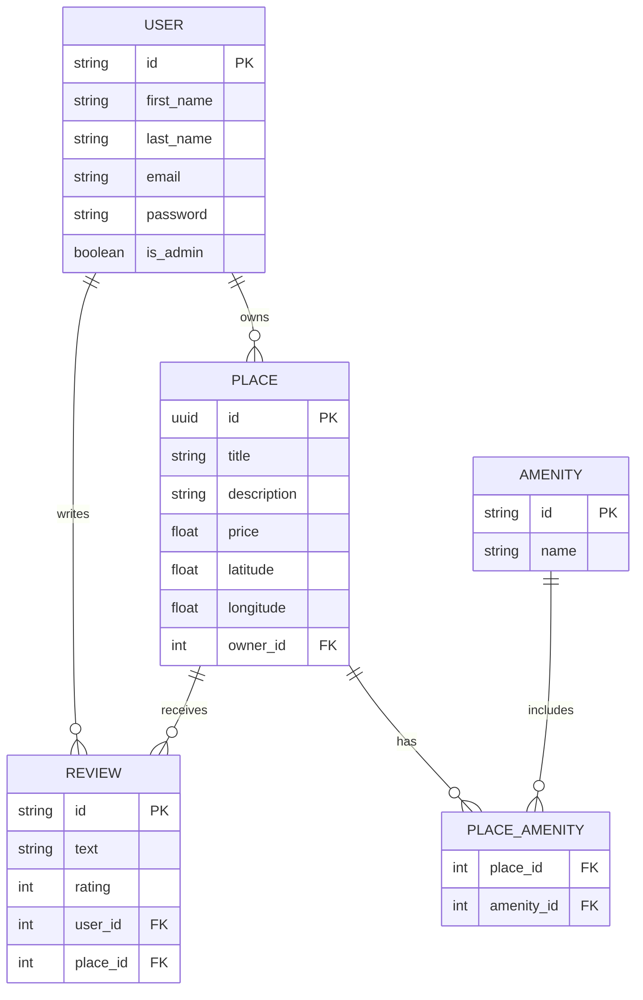

```mermaid
erDiagram

    USER {
        string id PK
        string first_name
        string last_name
        string email
        string password
        boolean is_admin
    }

    PLACE {
        uuid id PK
        string title
        string description
        float price
        float latitude
        float longitude
        int owner_id FK
    }

    REVIEW {
        string id PK
        string text
        int rating
        int user_id FK
        int place_id FK
    }

    AMENITY {
        string id PK
        string name
    }

    PLACE_AMENITY {
        int place_id FK
        int amenity_id FK
    }

    USER ||--o{ PLACE : owns
    USER ||--o{ REVIEW : writes
    PLACE ||--o{ REVIEW : receives
    PLACE ||--o{ PLACE_AMENITY : has
    AMENITY ||--o{ PLACE_AMENITY : includes
```
