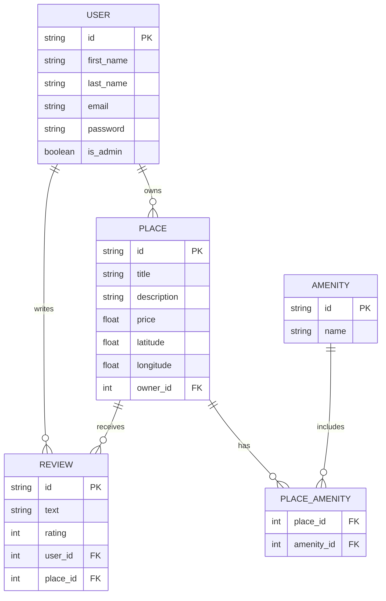

# HBnB - Part 3 (Database & Authentication)

## 📌 Overview

In this phase of the HBnB project, we extend Part 2 by integrating a **relational database (SQL)**, implementing **JWT-based authentication**, and adding **role-based access control** (admin checks). The project maintains the modular 3-layer architecture while replacing in-memory storage with persistent database storage and adding security features.

### Key Additions in Part 3:
- **Database Integration**: SQL-based repository with SQLAlchemy ORM relationships
- **JWT Authentication**: Secure login endpoint with token-based access
- **Role-Based Access**: Admin checks for protected operations
- **Place Deletion**: DELETE endpoint for places with authorization
- **Database Relations**: Proper foreign key relationships between entities

## ✅ Objectives

- **Integrate a Relational Database:**
  Replace in-memory repository with SQL database, implement proper relationships between entities, and use the repository pattern for data persistence.

- **Implement JWT Authentication:**
  Create login endpoint that issues JWT tokens, validate credentials using password hashing, and include admin claims in tokens.

- **Add Authorization & Role Management:**
  Implement protected endpoints with admin-only access checks for sensitive operations like user and place deletion.

- **Enhance Business Logic Layer:**
  Build core classes with database relationships, maintain the **Facade pattern**, and implement proper validation and error handling.

- **Test and Validate Security:**
  Ensure authentication flows work correctly, validate authorization checks, and test database constraints.

## 🧾 Learning Objectives

- Relational Database Design and Integration
- JWT Authentication and Authorization
- Role-Based Access Control (RBAC)
- SQLAlchemy ORM and Relationships
- Repository Pattern for Data Persistence
- API Security Best Practices
- Password Hashing and Credential Validation
- Modular Architecture with Database Layer

## 📁 Project Structure

```
hbnb/
├── app/
│   ├── __init__.py
│   ├── api/
│   │   ├── __init__.py
│   │   └── v1/
│   │       ├── __init__.py
│   │       ├── users.py
│   │       ├── places.py
│   │       ├── reviews.py
│   │       ├── amenities.py
│   │       ├── auth.py              # NEW: JWT Login endpoint
│   │       └── protected.py         # NEW: Protected endpoints for admin
│   ├── models/
│   │   ├── __init__.py
│   │   ├── base_model.py
│   │   ├── user.py                 # Updated: password hashing & is_admin
│   │   ├── place.py
│   │   ├── review.py
│   │   └── amenity.py
│   ├── services/
│   │   ├── __init__.py
│   │   └── facade.py               # Updated: database operations
│   └── persistence/
│       ├── __init__.py
│       ├── repository.py           # Updated: SQL-based repository
│       └── repositories/           # NEW: Specialized repositories
│           ├── __init__.py
│           ├── user_repository.py
│           ├── place_repository.py
│           ├── review_repository.py
│           └── amenity_repository.py
├── instance/
│   ├── drop_and_create_tables.sql   # NEW: Database schema
│   └── insert_data.sql              # NEW: Sample data
├── tests/
│   ├── __init__.py
│   ├── test_user.py
│   ├── test_amenity.py
│   ├── test_place.py
│   └── test_review.py
├── run.py
├── config.py                       # Updated: database configuration
├── requirements.txt                # Updated: added SQLAlchemy, Flask-JWT
└── README.md
```

### Key Files - Part 3 Additions

| File                                    | Role                                                                                 |
| --------------------------------------- | ------------------------------------------------------------------------------------ |
| `app/api/v1/auth.py`                    | JWT login endpoint with credential validation                                       |
| `app/api/v1/protected.py`               | Protected endpoints with admin-only access checks                                    |
| `app/persistence/repositories/`         | Specialized repositories for each entity with database queries                       |
| `app/models/user.py`                    | Updated with password hashing, `is_admin` flag, and `verify_password()` method       |
| `instance/drop_and_create_tables.sql`   | Database schema with foreign key relationships                                       |
| `config.py`                             | Database connection configuration                                                    |

## ⚒️ Architecture

The application follows a **4-layer architecture** (Part 3):

| Layer              | Description                                                              | Location                        |
| ------------------ | ------------------------------------------------------------------------ | ------------------------------- |
| **Presentation**   | Flask-RESTX API endpoints (CRUD + Auth)                                  | `app/api/v1/`                   |
| **Business Logic** | Models (`User`, `Place`, `Review`, `Amenity`) + Facade pattern           | `app/models/` + `app/services/` |
| **Persistence**    | SQL-based repositories with SQLAlchemy ORM relationships                  | `app/persistence/`              |
| **Database**       | Relational database (SQL) with foreign key relationships                  | `instance/`                     |

### Facade Pattern & Repositories

All API endpoints communicate exclusively through a single `HBnBFacade` instance, which delegates to specialized repositories:

```
API → HBnBFacade → Repositories → Database
```

Each repository handles:
- ✅ Entity-specific queries
- ✅ Relationship management (through ORM)
- ✅ Validation and constraints
- ✅ CRUD operations with persistence

## 📥 Installation & Setup

### Prerequisites

- Python 3.8+
- pip
- Virtual environment tool (optional but recommended)

### Steps

1. Clone the repository:

```bash
git clone https://github.com/<your-username>/holbertonschool-hbnb.git
cd holbertonschool-hbnb/part3/hbnb
```

2. Create a virtual environment (recommended):

```bash
python3 -m venv venv
source venv/bin/activate
```

3. Install dependencies:

```bash
pip install -r requirements.txt
```

## 🔎 Usage

1. Run the application:

```bash
python run.py
```

2. Open a browser and visit: http://127.0.0.1:5000

3. Swagger documentation is accessible at: http://127.0.0.1:5000/api/v1/

## � Authentication & Authorization

### JWT Login

Part 3 introduces JWT-based authentication for secure API access.

| Method | Endpoint            | Description                  | Status Codes |
| ------ | ------------------- | ---------------------------- | ------------ |
| POST   | `/api/v1/auth/login` | Authenticate and get JWT token | 201, 401     |

**Login with Credentials**

```bash
curl -X POST http://127.0.0.1:5000/api/v1/auth/login \
  -H "Content-Type: application/json" \
  -d '{
    "email": "john.doe@example.com",
    "password": "your_password"
  }'
```

Response (201):

```json
{
  "access_token": "eyJ0eXAiOiJKV1QiLCJhbGciOiJIUzI1NiJ9..."
}
```

### Using JWT Tokens in Protected Endpoints

Include the token in the `Authorization` header for protected operations:

```bash
curl -X DELETE http://127.0.0.1:5000/api/v1/places/<place_id> \
  -H "Authorization: Bearer <access_token>"
```

### Admin Access

Certain endpoints (like place and user deletion) require `is_admin` claim in the JWT token. Only users with `is_admin=true` can access these operations.

---

## 🔁 API Endpoints & cURL Examples

> 💡 All endpoints are prefixed with `/api/v1/`
> 
> ⚠️ Some endpoints require JWT authentication (marked with 🔒)

### Users

| Method | Endpoint                  | Description           | Status Codes    |
| ------ | ------------------------- | --------------------- | --------------- |
| POST   | `/api/v1/users/`          | Register a new user   | 201, 400        |
| GET    | `/api/v1/users/`          | Retrieve all users    | 200             |
| GET    | `/api/v1/users/<user_id>` | Retrieve a user by ID | 200, 404        |
| PUT    | `/api/v1/users/<user_id>` | Update a user         | 200, 400, 404   |
| DELETE | `/api/v1/users/<user_id>` | 🔒 Delete a user (admin only) | 200, 403, 404   |

**Create a User**

```bash
curl -X POST http://127.0.0.1:5000/api/v1/users/ \
  -H "Content-Type: application/json" \
  -d '{
    "first_name": "John",
    "last_name": "Doe",
    "email": "john.doe@example.com"
  }'
```

Response (201):

```json
{
  "id": "3fa85f64-5717-4562-b3fc-2c963f66afa6",
  "first_name": "John",
  "last_name": "Doe",
  "email": "john.doe@example.com"
}
```

**Get All Users**

```bash
curl http://127.0.0.1:5000/api/v1/users/
```

**Get User by ID**

```bash
curl http://127.0.0.1:5000/api/v1/users/<user_id>
```

**Update a User**

```bash
curl -X PUT http://127.0.0.1:5000/api/v1/users/<user_id> \
  -H "Content-Type: application/json" \
  -d '{
    "first_name": "Jane",
    "last_name": "Doe",
    "email": "jane.doe@example.com"
  }'
```

> 💡 Use a valid `user_id`

---

### Amenities

| Method | Endpoint                         | Description               | Status Codes  |
| ------ | -------------------------------- | ------------------------- | ------------- |
| POST   | `/api/v1/amenities/`             | Create a new amenity      | 201, 400      |
| GET    | `/api/v1/amenities/`             | Retrieve all amenities    | 200           |
| GET    | `/api/v1/amenities/<amenity_id>` | Retrieve an amenity by ID | 200, 404      |
| PUT    | `/api/v1/amenities/<amenity_id>` | Update an amenity         | 200, 400, 404 |

**Create an Amenity**

```bash
curl -X POST http://127.0.0.1:5000/api/v1/amenities/ \
  -H "Content-Type: application/json" \
  -d '{"name": "Wi-Fi"}'
```

Response (201):

```json
{
  "id": "1fa85f64-5717-4562-b3fc-2c963f66afa6",
  "name": "Wi-Fi"
}
```

**Update an Amenity**

```bash
curl -X PUT http://127.0.0.1:5000/api/v1/amenities/<amenity_id> \
  -H "Content-Type: application/json" \
  -d '{"name": "Air Conditioning"}'
```

> 💡 Use a valid `amenity_id`

---

### Places

| Method | Endpoint                            | Description                           | Status Codes    |
| ------ | ----------------------------------- | ------------------------------------- | --------------- |
| POST   | `/api/v1/places/`                   | Create a new place                    | 201, 400        |
| GET    | `/api/v1/places/`                   | Retrieve all places                   | 200             |
| GET    | `/api/v1/places/<place_id>`         | Retrieve a place by ID                | 200, 404        |
| PUT    | `/api/v1/places/<place_id>`         | Update a place                        | 200, 400, 404   |
| DELETE | `/api/v1/places/<place_id>`         | 🔒 Delete a place (owner/admin only)   | 200, 403, 404   |
| GET    | `/api/v1/places/<place_id>/reviews` | Get all reviews for a place           | 200, 404        |

**Create a Place**

```bash
curl -X POST http://127.0.0.1:5000/api/v1/places/ \
  -H "Content-Type: application/json" \
  -d '{
    "title": "Cozy Apartment",
    "description": "A nice place to stay",
    "price": 100.0,
    "latitude": 48.8566,
    "longitude": 2.3522,
    "owner_id": "<user_id>"
  }'
```

> 💡 Use a valid `user_id`

Response (201):

```json
{
  "id": "2fa85f64-5717-4562-b3fc-2c963f66afa6",
  "title": "Cozy Apartment",
  "description": "A nice place to stay",
  "price": 100.0,
  "latitude": 48.8566,
  "longitude": 2.3522,
  "owner_id": "<user_id>"
}
```

#### ⚠️ Validation Rules for Places

| Field       | Rule                                               |
| ----------- | -------------------------------------------------- |
| `title`     | Required, max 100 characters                       |
| `price`     | Required, must be a positive number                |
| `latitude`  | Required, must be between -90 and 90 (inclusive)   |
| `longitude` | Required, must be between -180 and 180 (inclusive) |
| `owner_id`  | Required, must reference an existing user          |

---

### Reviews

| Method | Endpoint                      | Description             | Status Codes  |
| ------ | ----------------------------- | ----------------------- | ------------- |
| POST   | `/api/v1/reviews/`            | Create a new review     | 201, 400      |
| GET    | `/api/v1/reviews/`            | Retrieve all reviews    | 200           |
| GET    | `/api/v1/reviews/<review_id>` | Retrieve a review by ID | 200, 404      |
| PUT    | `/api/v1/reviews/<review_id>` | Update a review         | 200, 400, 404 |
| DELETE | `/api/v1/reviews/<review_id>` | Delete a review         | 200, 404      |

> ⚠️ DELETE is only implemented for reviews in this part of the project.

**Create a Review**

```bash
curl -X POST http://127.0.0.1:5000/api/v1/reviews/ \
  -H "Content-Type: application/json" \
  -d '{
    "text": "Amazing place, highly recommended!",
    "rating": 5,
    "user_id": "<user_id>",
    "place_id": "<place_id>"
  }'
```

> 💡 Use valid `user_id` & `place_id`

Response (201):

```json
{
  "id": "4fa85f64-5717-4562-b3fc-2c963f66afa6",
  "text": "Amazing place, highly recommended!",
  "rating": 5,
  "user_id": "<user_id>",
  "place_id": "<place_id>"
}
```

**Delete a Review**

```bash
curl -X DELETE http://127.0.0.1:5000/api/v1/reviews/<review_id>
```

> 💡 Use a valid `review_id`

Response (200):

```json
{
  "message": "Review deleted successfully"
}
```

#### ⚠️ Validation Rules for Reviews

| Field      | Rule                                       |
| ---------- | ------------------------------------------ |
| `text`     | Required, cannot be empty                  |
| `rating`   | Required, integer between 1 and 5          |
| `user_id`  | Required, must reference an existing user  |
| `place_id` | Required, must reference an existing place |

---

## 🧪 Unit Tests

The project includes a comprehensive test suite located in the `tests/` directory. Tests cover all API endpoints for users, amenities, places, and reviews.

### Running the Tests

```bash
python3 -m unittest discover -s tests -v
```

> 📝 **Note**: Tests in Part 3 use in-memory repositories for isolation. Database integration tests are **not yet implemented**.

### Test Coverage

| Module              | Status | Description                                                    |
| ------------------- | ------ | -------------------------------------------------------------- |
| User CRUD + Validation   | ✅ Complete | Create, read, update operations with input validation           |
| Amenity CRUD         | ✅ Complete | Create, read, update operations                                |
| Place CRUD + Validation  | ✅ Complete | Create, read, update + boundary testing for coordinates        |
| Review CRUD + Delete     | ✅ Complete | Full lifecycle testing including delete operations             |
| **Authentication**   | ❌ Pending  | JWT token generation, login flow validation                    |
| **Authorization**    | ❌ Pending  | Admin checks for delete operations, role-based access          |
| **Database Layer**   | ❌ Pending  | SQLAlchemy ORM relationships, persistence verification         |
| **Error Handling**   | ⚠️ Partial  | Coverage for validation errors; missing HTTP exception tests   |

### Future Test Enhancements

- ✅ Implement authentication tests:
  - Successful login with valid credentials
  - Failed login with invalid credentials
  - JWT token validation and expiration
  
- ✅ Implement authorization tests:
  - Admin-only deletion attempts (403 Forbidden)
  - Owner-only place deletion verification
  - Token refresh and revocation
  
- ✅ Implement database integration tests:
  - Verify persistent storage
  - Test foreign key relationships
  - Test cascade delete operations
  
- ✅ Implement comprehensive error handling tests:
  - Database connection failures
  - Constraint violations
  - Transaction rollback scenarios

---

## 📊 Architecture Diagrams

### High-Level Class Diagram

The HBnB system architecture follows a modular design with distinct layers:

```
┌─────────────────────────────────────────────────┐
│          Presentation Layer (API)               │
│  /users  /places  /reviews  /amenities  /auth   │
└─────────────────────────────────────────────────┘
                      ↓
┌─────────────────────────────────────────────────┐
│       Business Logic Layer (Facade)             │
│         HBnBFacade (Central Hub)                │
└─────────────────────────────────────────────────┘
                      ↓
┌─────────────────────────────────────────────────┐
│    Persistence Layer (Repositories)             │
│  UserRepo | PlaceRepo | ReviewRepo | AmenityRepo
└─────────────────────────────────────────────────┘
                      ↓
┌─────────────────────────────────────────────────┐
│    Database Layer (SQL)                         │
│  Users | Places | Reviews | Amenities (Tables) │
└─────────────────────────────────────────────────┘
```

### Sequence Diagrams

The `/part1/` directory contains detailed Mermaid sequence diagrams for key user flows:

- **[User Registration](../part1/Sequence-Diagram-User_Registration.mmd)** — User creation with validation
- **[Place Creation](../part1/Sequence-Diagram-Place_Creation.mmd)** — Place submission with owner assignment
- **[Review Submission](../part1/Sequence-Diagram-Review_Submission.mmd)** — Review creation with references
- **[Fetching Places List](../part1/Sequence-Diagram-Fetching_a_List_of_Places.mmd)** — Retrieving places with filters

### Database Diagram

Database schema with relationships:

- **Users** ← (1:Many) → **Places** (owner_id)
- **Users** ← (1:Many) → **Reviews** (user_id)
- **Places** ← (1:Many) → **Reviews** (place_id)
- **Amenities** ← (Many:Many) → **Places** (association table)

### Entity-Relationship Diagram




---

## 📘 Resources

### Part 3 Core Documentation
- [Flask-SQLAlchemy](https://flask-sqlalchemy.palletsprojects.com/) — ORM integration for Flask
- [Flask-JWT-Extended](https://flask-jwt-extended.readthedocs.io/) — JWT authentication for Flask
- [SQLAlchemy Relationships](https://docs.sqlalchemy.org/en/14/orm/basic_relationships.html) — Database relationship patterns
- [Password Hashing with Werkzeug](https://werkzeug.palletsprojects.com/en/2.0.x/security/) — Secure password handling

### General References
- [Flask Documentation](https://flask.palletsprojects.com/)
- [Flask-RESTx Documentation](https://flask-restx.readthedocs.io/)
- [Python Project Structure Best Practices](https://docs.python-guide.org/writing/structure/)
- [Facade Design Pattern in Python](https://refactoring.guru/design-patterns/facade/python/example)
- [Repository Pattern Guide](https://medium.com/@pererikbergman/the-repository-pattern-f1c32fbc2f70)
- [REST API Best Practices](https://restfulapi.net/)
- [JWT Best Practices](https://tools.ietf.org/html/rfc8725)
- [OWASP API Security](https://owasp.org/www-project-api-security/)

## 👥 Authors

Yasi Hubner

Mario Colomas

Thanks to this guy, CHARLES BACHMAN
